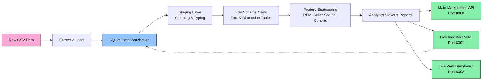
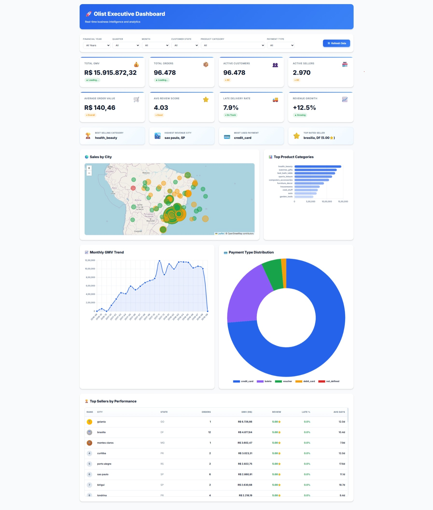
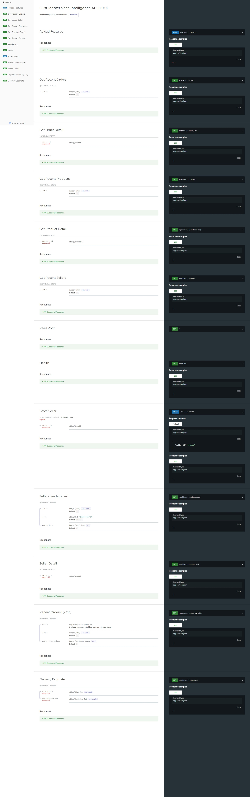
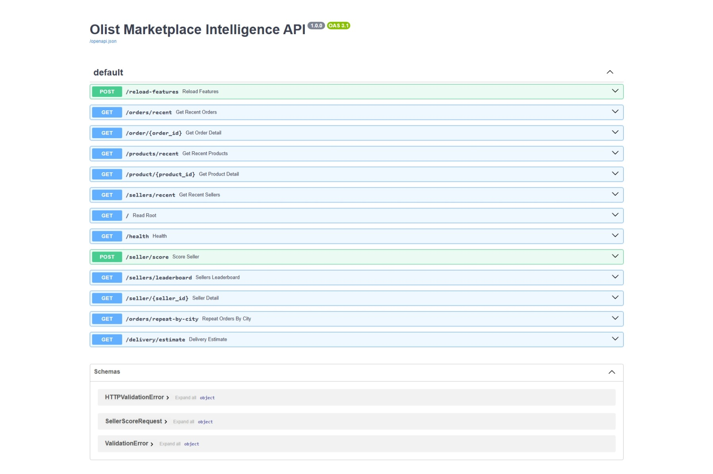

# Olist Marketplace Analytics Engineering Platform

**A modern analytics stack for the Olist marketplace data, built with Python, FastAPI, SQLite, dbt, and dashboard APIs.**

---

## 🚀 What this project does
- Loads 9 raw Olist CSV files into a warehouse
- Cleans and stages the data
- Builds star-schema marts and analytics views
- Generates seller, customer, delivery, and retention insights
- Exposes three live apps:
  - **Main API** for analytics endpoints
  - **Ingestor portal** for live data entry
  - **Dashboard** for visual reports

---

## ✨ Why it is useful
- Turn raw marketplace data into business intelligence
- Support seller performance, delivery analytics, and customer insights
- Easy local setup with SQLite and no cloud credentials required
- Render-ready deployment path for production

---

## Architecture



The runnable local version uses SQLite so the full project can be executed without cloud credentials. The `dbt/`, `airflow/`, and `docker-compose.yml` files show how the same design maps to PostgreSQL/Supabase, dbt, and Airflow in production.
## 🧭 Quick start
Run everything from the project folder:

```powershell
cd output/data_analysis_platform
pip install -r requirements.txt
python start_services.py
```

Then open:
- **Main API**: `http://127.0.0.1:8000`
- **Ingestor Portal**: `http://127.0.0.1:8001`
- **Dashboard**: `http://127.0.0.1:8002`

### Test the services
```powershell
curl http://127.0.0.1:8000/health
curl http://127.0.0.1:8001/health
curl http://127.0.0.1:8002/health
```

---

## 📁 Project structure

```text
output/data_analysis_platform/
  src/olist_platform/
    api/
      main.py          # Main analytics API
      ingestor.py      # Live data ingestion portal
      dashboard_api.py # Dashboard backend
    config.py          # paths and file configuration
    db.py              # SQLite + Postgres connection helper
    extract_load.py    # raw CSV ingestion
    transform.py       # staging and mart SQL processing
    feature_engineering.py # feature outputs and reports
  requirements.txt
  start_services.py
  render.yaml
  README.md
```

---

## 🧪 Local pipeline commands
If you need to rebuild the warehouse first:

```powershell
python -m src.olist_platform.extract_load
python -m src.olist_platform.transform
python -m src.olist_platform.feature_engineering
python -m src.olist_platform.run_quality_checks
```

Then start the apps:

```powershell
python start_services.py
```

---


---

## 📊 API highlights
The Main API includes endpoints for:
- `/orders/recent`
- `/order/{order_id}`
- `/products/recent`
- `/product/{product_id}`
- `/sellers/recent`
- `/seller/score`
- `/sellers/leaderboard`
- `/orders/repeat-by-city`
- `/delivery/estimate`

The Dashboard and Ingestor also provide their own UIs and live entry tooling.


---

## 🚀 Production upgrade path
1. Replace SQLite with Postgres / Supabase
2. Use `dbt` models in `dbt/models`
3. Schedule with `airflow/dags/olist_pipeline_dag.py`
4. Deploy the FastAPI service behind a private endpoint for production operations

---

## �️ Screenshots
Add your web UI screenshots here to make this repo more attractive and easier to browse on GitHub.

| Dashboard | API Docs | Ingestor Portal |
|---|---|---|
|  |  |  |  |  |

> Tip: save your screenshot files in `output/data_analysis_platform/docs/` and commit them with the repo.

This will make the README visually rich in both light and dark GitHub themes.

## 💡 Want the dashboard style?
This repo already includes a polished dashboard concept and API docs, so your deployment can support both:
- live analytics API
- ingestion portal
- visual dashboard

## Core Metrics

- **GMV:** sum of item price plus freight.
- **Delivery delay:** delivered customer date later than estimated delivery date.
- **Delivery days:** days from purchase to customer delivery.
- **Seller performance score:**
  - 40% on-time delivery rate
  - 30% normalized review score
  - 20% inverse cancellation rate
  - 10% revenue growth score
- **RFM:** customer recency, frequency, and monetary value based on delivered orders.

## Dashboard Specification

Power BI should connect to `data/warehouse/olist.db` or the generated CSVs in `reports/`.

Recommended pages:

1. **Executive Summary**
   - Total GMV
   - Delivered order volume
   - Active sellers
   - Monthly GMV trend
   - Top 10 categories
2. **Operations**
   - Delivery SLA compliance by seller state
   - Late delivery rate by category
   - Seller tier distribution
   - Average delivery days by lane
3. **Customer Intelligence**
   - RFM segment distribution
   - Monthly cohort retention heatmap
   - Customer monetary value by state/category

## Production Upgrade Path

- Replace SQLite with Supabase/PostgreSQL.
- Run the models in `dbt/models` through dbt Core.
- Use the Airflow DAG to schedule ingestion, dbt runs, tests, and dashboard refresh.
- Deploy the FastAPI service behind a private endpoint for operations tooling.


If you want, I can also add a small `README` section with a launch checklist and image captions for each screen.

