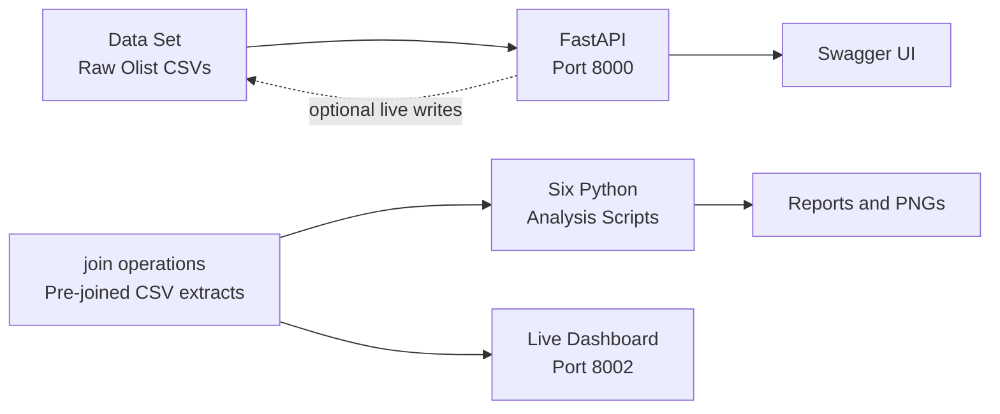
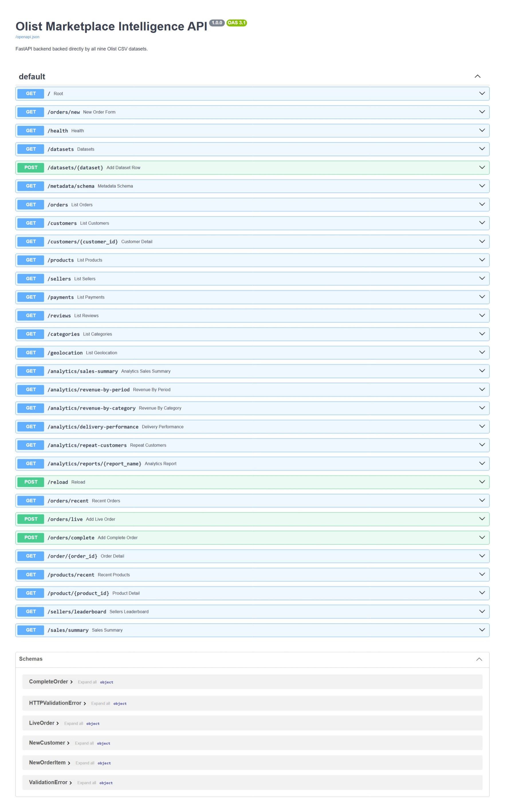
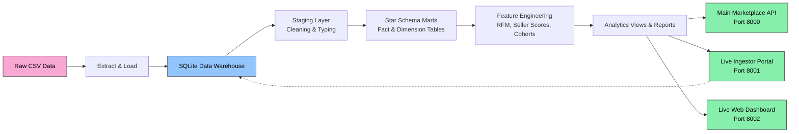
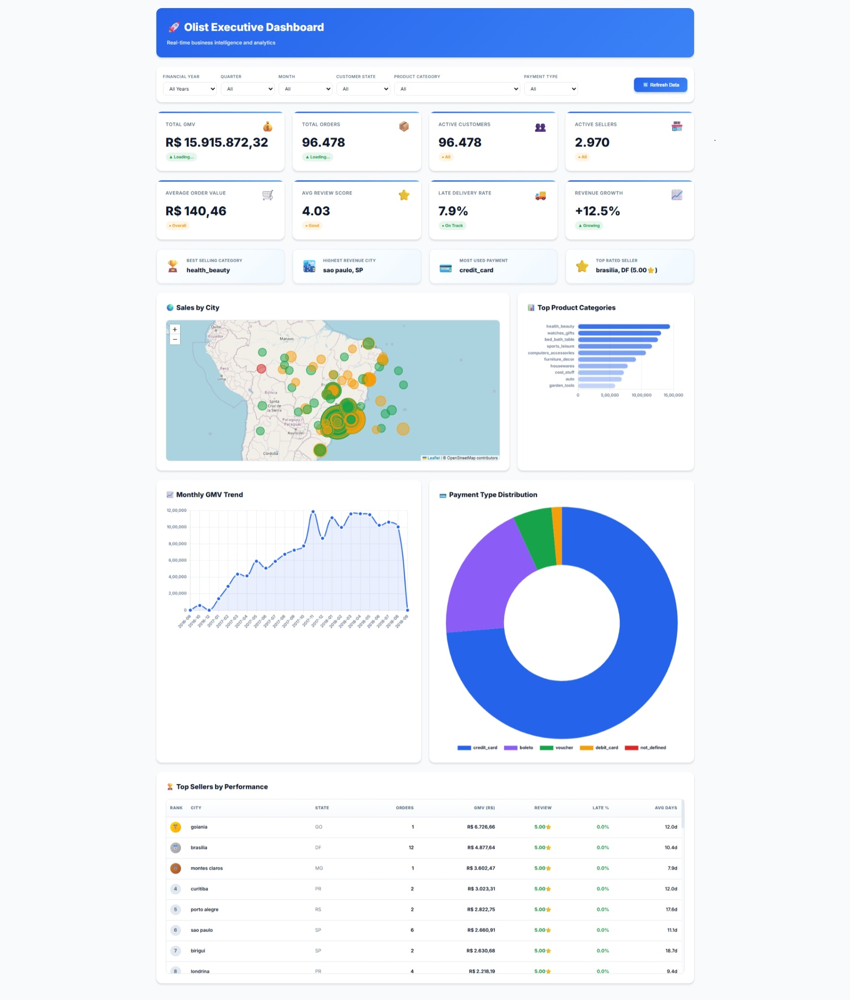
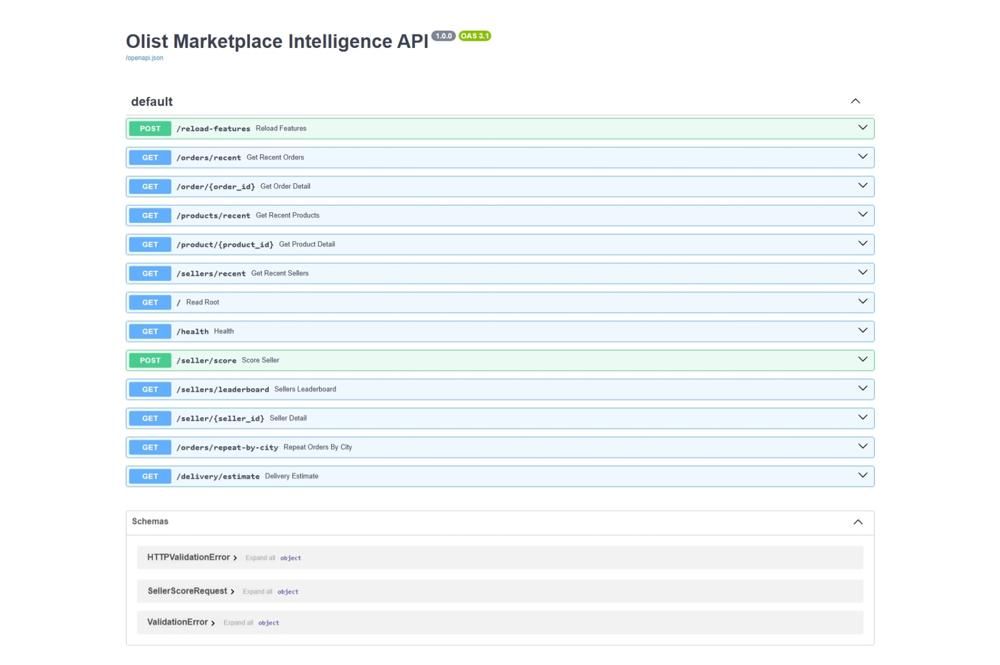
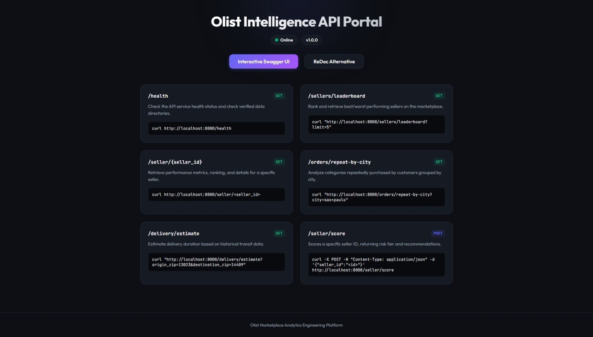
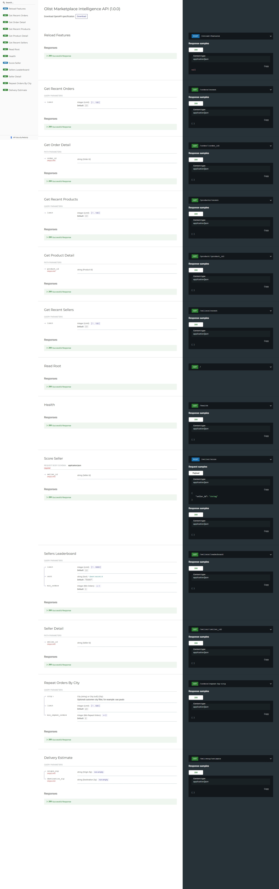
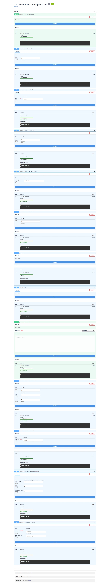

# Olist Marketplace Intelligence

An end-to-end analytics project for the Brazilian Olist marketplace dataset. It combines pre-joined CSV extracts, a six-step Python analysis pipeline, interactive dashboards, generated business visuals, and a CSV-backed FastAPI service.


## What this project includes
- **Joined-data analysis:** reads the existing files in `join operations/` directly. The analysis pipeline does not repeat the SQL join process.
- **Six Python analysis scripts:** setup, cleaning, feature engineering, EDA, RFM segmentation, forecasting, predictive modeling, and report generation.
- **Live dashboard:** filters and reloads the joined CSV data through a FastAPI service on port `8002`.
- **Marketplace API:** reads the nine raw Olist CSV datasets, exposes analytical endpoints, and supports live order entry on port `8000`.
- **Visual outputs:** charts for delivery, reviews, sales, payments, categories, customer segments, forecasting, and model performance.

## Open the project

These links work after starting the relevant local service:

| Experience | Link |
|---|---|
| Live joined-data dashboard | [http://127.0.0.1:8002](http://127.0.0.1:8002) when the dashboard service is running |
| Main FastAPI Swagger UI | [http://127.0.0.1:8000/docs](http://127.0.0.1:8000/docs) |
| FastAPI order-entry form | [http://127.0.0.1:8000/orders/new](http://127.0.0.1:8000/orders/new) |
| Dashboard visual assets | [Dashboard/](Dashboard/) |
## Architecture


```mermaid
flowchart LR
    A[Data Set\nRaw Olist CSVs] --> B[FastAPI\nPort 8000]
    C[join operations\nPre-joined CSV extracts] --> D[Six Python\nAnalysis Scripts]
    C --> E[Live Dashboard\nPort 8002]
    D --> F[Reports and PNGs]
    B --> G[Swagger UI]
    B -. optional live writes .-> A
```

The two data paths are intentional:

1. `Data Set/` contains the raw source files used by the FastAPI backend.
2. `join operations/` contains the already-joined extracts used by the analysis pipeline and live dashboard.

## Quick start

### 1. Create or activate the Python environment

PowerShell from the repository root:

```powershell
.\.venv\Scripts\Activate.ps1
```

Install the backend requirements:

```powershell
pip install -r output/data_analysis_platform_backend_and_report/requirements.txt
```

The analysis scripts additionally use packages such as `matplotlib`, `seaborn`, `pyarrow`, `imbalanced-learn`, and `prophet`. Install them if they are not already present in the environment:

```powershell
pip install pandas numpy scipy scikit-learn matplotlib seaborn pyarrow imbalanced-learn prophet
```

### 2. Start the FastAPI backend

```powershell
Set-Location output/data_analysis_platform_backend_and_report
python -m uvicorn fastapi_app:app --host 127.0.0.1 --port 8000 --reload
```

Open the interactive API documentation at [http://127.0.0.1:8000/docs](http://127.0.0.1:8000/docs).

The backend loads the raw files from `Data Set/` by default. To use another directory:

```powershell
$env:OLIST_DATA_DIR = "C:\path\to\csv\folder"
python -m uvicorn fastapi_app:app --host 127.0.0.1 --port 8000 --reload
```

### 3. View the dashboard visuals

The repository includes dashboard-ready PNG assets in [Dashboard/](Dashboard/). The live dashboard link above points to the local dashboard service used with this project when it is running on port `8002`.

## FastAPI usage

The API is useful for dashboards, analysis clients, and live data entry. Important routes include:

| Area | Routes |
|---|---|
| Health and metadata | `/health`, `/`, `/datasets`, `/metadata/schema` |
| Orders | `/orders/recent`, `/orders/live`, `/orders/new`, `/order/{order_id}` |
| Catalog | `/products/recent`, `/product/{product_id}`, `/categories` |
| Marketplace entities | `/customers`, `/sellers/leaderboard`, `/payments`, `/reviews`, `/geolocation` |
| Analytics | `/sales/summary`, `/analytics/sales-summary`, `/analytics/revenue-by-period`, `/analytics/delivery-performance` |
| Reports | `/analytics/reports/customer-rfm`, `/analytics/reports/cohort-retention`, `/analytics/reports/delivery-lanes`, `/analytics/reports/seller-scores` |
| Refresh | `/reload` |

Example health check:

```powershell
Invoke-RestMethod http://127.0.0.1:8000/health
```

Example live order request:

```powershell
$body = @{
  order_id = "new-order-001"
  customer_id = "existing-customer-id"
  order_status = "created"
  order_purchase_timestamp = "2026-09-22 12:00:00"
} | ConvertTo-Json

Invoke-RestMethod http://127.0.0.1:8000/orders/live `
  -Method Post -ContentType "application/json" -Body $body
```

For a complete purchase containing a customer, order, and item records, use `POST /orders/complete` from Swagger. New records are written to the raw CSV source when possible; the fallback `live_orders.csv` file is used when the source directory is not writable.

## Six-file analysis pipeline

Run these scripts in order from the repository root:

```powershell
$python = ".\.venv\Scripts\python.exe"
$scripts = "Data_Analysist_Concept\olist_project\scripts"

& $python "$scripts\00_setup_and_load.py"
& $python "$scripts\01_cleaning_feature_engineering.py"
& $python "$scripts\02_eda_kpis_statistical_tests.py"
& $python "$scripts\03_customer_segmentation_rfm.py"
& $python "$scripts\04_modeling_forecasting.py"
& $python "$scripts\05_final_report.py"
```

| Script | Purpose |
|---|---|
| [00_setup_and_load.py](Data_Analysist_Concept/olist_project/scripts/00_setup_and_load.py) | Loads the seven joined CSV extracts and builds the analysis-ready table. |
| [01_cleaning_feature_engineering.py](Data_Analysist_Concept/olist_project/scripts/01_cleaning_feature_engineering.py) | Cleans types and creates order value, shipping time, delivery time, and delay features. |
| [02_eda_kpis_statistical_tests.py](Data_Analysist_Concept/olist_project/scripts/02_eda_kpis_statistical_tests.py) | Generates EDA charts, KPIs, correlations, and the Kruskal-Wallis test. |
| [03_customer_segmentation_rfm.py](Data_Analysist_Concept/olist_project/scripts/03_customer_segmentation_rfm.py) | Creates RFM segments and K-means customer clusters. |
| [04_modeling_forecasting.py](Data_Analysist_Concept/olist_project/scripts/04_modeling_forecasting.py) | Forecasts daily sales and predicts bad reviews with classification models. |
| [05_final_report.py](Data_Analysist_Concept/olist_project/scripts/05_final_report.py) | Creates the final Markdown report and checks referenced figures. |

Supporting reusable code is in [Data_Analysist_Concept/olist_project/src](Data_Analysist_Concept/olist_project/src). Processed parquet files are written to `Data_Analysist_Concept/olist_project/data/processed/`, and charts are written to `Data_Analysist_Concept/olist_project/outputs/figures/`.

## Visual gallery

### FastAPI interface

[](http://127.0.0.1:8000/docs)

Open the image directly: [FastAPI.jpeg](output/data_analysis_platform_backend_and_report/FastAPI.jpeg).

### Dashboard visuals

| Monthly growth dashboard | Revenue trend | Category value |
|---|---|---|
|  |  |  |

### Analysis outputs

| Delivery and reviews | Customer segmentation | Forecasting |
|---|---|---|
| [Shipping time vs review score](Data_Analysist_Concept/olist_project/outputs/figures/box_shipping_time_by_review_score.png) | [Customer segment distribution](Data_Analysist_Concept/olist_project/outputs/figures/customer_segments_distribution.png) | [Prophet forecast](Data_Analysist_Concept/olist_project/outputs/figures/prophet_forecast_vs_actual.png) |

More generated visuals are available in [Data_Analysist_Concept/olist_project/outputs/figures](Data_Analysist_Concept/olist_project/outputs/figures), including product category performance, payment behavior, delivery delay, RFM clusters, ROC curves, and correlation heatmaps.

## Repository map

```text
Data Set/                                  Raw Olist CSV source files
join operations/                           Existing pre-joined analysis extracts
Data_Analysist_Concept/olist_project/
  scripts/                                 Six ordered analysis scripts
  src/                                     Reusable cleaning, feature, data, and chart helpers
  data/processed/                          Generated parquet datasets
  outputs/figures/                         Generated PNG charts
  outputs/reports/                         Generated Markdown reports
Dashboard/                                 Dashboard-ready PNG visuals
output/data_analysis_platform_backend.../  Main FastAPI backend on port 8000
```

## Key metrics

- **Order value:** item price plus freight value.
- **Shipping time:** days between purchase and customer delivery.
- **Shipping delay:** delivered date minus estimated delivery date.
- **RFM:** customer recency, purchase frequency, and monetary value.
- **Bad review:** review score less than or equal to 2.

## Troubleshooting

- **Port already in use:** start the service on another port, for example `--port 8003`, then open the matching URL.
- **Dashboard is unavailable:** confirm the separate dashboard service is running on port `8002` before opening the dashboard URL.
- **Missing parquet file:** run the analysis scripts in order, beginning with `00_setup_and_load.py`.
- **API cannot write to raw CSVs:** check file permissions; the backend can fall back to `output/data_analysis_platform_backend_and_report/live_orders.csv` for live order storage.
- **Changed CSV data:** use the dashboard reload action or call `POST http://127.0.0.1:8000/reload` for the main API.

## License and dataset note

This repository is an educational and portfolio analysis project. The Olist dataset is used for analysis and experimentation; review the dataset's original terms before redistributing the raw files.
# Olist Marketplace Analytics Engineering Platform

**A modern analytics stack for the Olist marketplace data, built with Python, FastAPI, SQLite, dbt, and dashboard APIs.**

---

## 🚀 What this project does
- Loads 9 raw Olist CSV files into a warehouse
- Cleans and stages the data
- Builds star-schema marts and analytics views
- Generates seller, customer, delivery, and retention insights
- Exposes three live apps:
  - **Main API** for analytics endpoints
  - **Ingestor portal** for live data entry
  - **Dashboard** for visual reports

---

## ✨ Why it is useful
- Turn raw marketplace data into business intelligence
- Support seller performance, delivery analytics, and customer insights
- Easy local setup with SQLite and no cloud credentials required
- Render-ready deployment path for production

---

## Architecture


```mermaid
flowchart LR
    A[Raw CSV Data] --> B[Extract & Load]
    B --> C[SQLite Data Warehouse]
    C --> D["Staging Layer<br/>Cleaning & Typing"]
    D --> E["Star Schema Marts<br/>Fact & Dimension Tables"]
    E --> F["Feature Engineering<br/>RFM, Seller Scores, Cohorts"]
    F --> G[Analytics Views & Reports]
    G --> H1["Main Marketplace API<br/>Port 8000"]
    G --> H2["Live Ingestor Portal<br/>Port 8001"]
    G --> H3["Live Web Dashboard<br/>Port 8002"]
    H2 -.-> C

    classDef source fill:#f9a8d4,stroke:#333,color:#000
    classDef warehouse fill:#93c5fd,stroke:#333,color:#000
    classDef live fill:#86efac,stroke:#333,color:#000

    class A source
    class C warehouse
    class H1,H2,H3 live
```

The runnable local version uses SQLite so the full project can be executed without cloud credentials. The `dbt/`, `airflow/`, and `docker-compose.yml` files show how the same design maps to PostgreSQL/Supabase, dbt, and Airflow in production.
## 🧭 Quick start
Run everything from the project folder:

```powershell
cd output/data_analysis_platform
pip install -r requirements.txt
python start_services.py
```

Then open:

### Standalone CSV FastAPI backend

To run the new backend directly against the attached `Data Set` folder:

```powershell
cd output/data_analysis_platform
python -m uvicorn fastapi_app:app --reload
```

Open `http://127.0.0.1:8000/docs`. The service loads all nine CSV files at startup. Set `OLIST_DATA_DIR` to use a different dataset folder, and call `POST /reload` after changing the CSVs.

To add a new order to the live CSV data, use `POST /orders/live` from Swagger or PowerShell:

```powershell
$body = @{
  order_id = "new-order-001"
  customer_id = "existing-customer-id"
  order_status = "created"
  order_purchase_timestamp = "2026-09-21 12:00:00"
} | ConvertTo-Json
Invoke-RestMethod http://127.0.0.1:8000/orders/live -Method Post -ContentType "application/json" -Body $body
```

The order is appended to `olist_orders_dataset.csv`, loaded into the running API, and returned in the `latest_5_orders` response. `GET /orders/recent` also returns the latest five orders by default.

For easier entry without JSON, open `http://127.0.0.1:8000/orders/new` in your browser. Fill in the form and click **Save order**.

If Windows prevents writing to the original attached dataset, the API automatically stores new orders in `output/data_analysis_platform/live_orders.csv`. That file is a normal CSV and is merged into the live API whenever it starts or when `POST /reload` is called. The `POST /orders/live` response includes the exact `stored_in` path.

### Complete API surface

The rebuilt API is organized for analysis clients and dashboards:

- Data access: `/metadata/schema`, `/datasets`, `/orders`, `/customers`, `/products`, `/sellers`, `/payments`, `/reviews`, `/categories`, `/geolocation`
- Detail access: `/order/{order_id}`, `/product/{product_id}`, `/customers/{customer_id}`
- Analytics: `/analytics/sales-summary`, `/analytics/revenue-by-period`, `/analytics/revenue-by-category`, `/analytics/delivery-performance`, `/analytics/repeat-customers`
- Reports: `/analytics/reports/customer-rfm`, `/analytics/reports/cohort-retention`, `/analytics/reports/delivery-lanes`, `/analytics/reports/seller-scores`

List endpoints support `page` and `page_size`; relevant endpoints also support filters such as `status`, `state`, `category`, and date ranges. Use `/docs` for the interactive request schemas.

### Test the services
```powershell
curl http://127.0.0.1:8000/health
curl http://127.0.0.1:8001/health
curl http://127.0.0.1:8002/health
```

---

## 📁 Project structure

```text
output/data_analysis_platform/
  src/olist_platform/
    api/
      main.py          # Main analytics API
      ingestor.py      # Live data ingestion portal
      dashboard_api.py # Dashboard backend
    config.py          # paths and file configuration
    db.py              # SQLite + Postgres connection helper
    extract_load.py    # raw CSV ingestion
    transform.py       # staging and mart SQL processing
    feature_engineering.py # feature outputs and reports
  requirements.txt
  start_services.py
  render.yaml
  README.md
```

---

## 🧪 Local pipeline commands
If you need to rebuild the warehouse first:

```powershell
python -m src.olist_platform.extract_load
python -m src.olist_platform.transform
python -m src.olist_platform.feature_engineering
python -m src.olist_platform.run_quality_checks
```

Then start the apps:

```powershell
python start_services.py
```

---


---

## 📊 API highlights
The Main API includes endpoints for:

For a real customer purchase, use `POST /orders/complete` so the customer,
order, and ordered products are saved together:

```json
{
  "customer": {
    "customer_id": "customer-new-001",
    "customer_unique_id": "unique-new-001",
    "customer_zip_code_prefix": "01001",
    "customer_city": "sao paulo",
    "customer_state": "SP"
  },
  "order": {
    "order_id": "order-new-001",
    "customer_id": "customer-new-001",
    "order_status": "created",
    "order_purchase_timestamp": "2026-09-22 12:00:00"
  },
  "items": [
    {
      "product_id": "existing-product-id",
      "seller_id": "existing-seller-id",
      "price": "99.90",
      "freight_value": "12.00"
    }
  ]
}
```

This request writes to `olist_customers_dataset.csv`,
`olist_orders_dataset.csv`, and `olist_order_items_dataset.csv`, then reloads
the API and rebuilds the joined analysis CSVs. The product and seller must
already exist; duplicate customer or order IDs are rejected.
The Dashboard and Ingestor also provide their own UIs and live entry tooling.


---

## 🚀 Production upgrade path
1. Replace SQLite with Postgres / Supabase
2. Use `dbt` models in `dbt/models`
3. Schedule with `airflow/dags/olist_pipeline_dag.py`
4. Deploy the FastAPI service behind a private endpoint for production operations

---

## �️ Screenshots

| Dashboard | Ingestor Portal | API Interface |
|---|---|---|
|  |  |  |

 | API Docs | Ingestor Ex |
 |---|---|
 |  |  |
 
## 💡 Want the dashboard style?
This repo already includes a polished dashboard concept and API docs, so your deployment can support both:
- live analytics API
- ingestion portal
- visual dashboard

## Core Metrics

- **GMV:** sum of item price plus freight.
- **Delivery delay:** delivered customer date later than estimated delivery date.
- **Delivery days:** days from purchase to customer delivery.
- **Seller performance score:**
  - 40% on-time delivery rate
  - 30% normalized review score
  - 20% inverse cancellation rate
  - 10% revenue growth score
- **RFM:** customer recency, frequency, and monetary value based on delivered orders.

## Dashboard Specification

Power BI should connect to `data/warehouse/olist.db` or the generated CSVs in `reports/`.

Recommended pages:

1. **Executive Summary**
   - Total GMV
   - Delivered order volume
   - Active sellers
   - Monthly GMV trend
   - Top 10 categories
2. **Operations**
   - Delivery SLA compliance by seller state
   - Late delivery rate by category
   - Seller tier distribution
   - Average delivery days by lane
3. **Customer Intelligence**
   - RFM segment distribution
   - Monthly cohort retention heatmap
   - Customer monetary value by state/category

## Production Upgrade Path

- Replace SQLite with Supabase/PostgreSQL.
- Run the models in `dbt/models` through dbt Core.
- Use the Airflow DAG to schedule ingestion, dbt runs, tests, and dashboard refresh.
- Deploy the FastAPI service behind a private endpoint for operations tooling.


