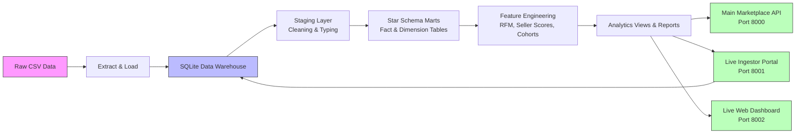

# Olist Marketplace Analytics Engineering Platform

This project turns the 9 raw Olist marketplace CSV files into a modeled analytics warehouse, feature-engineering layer, and small API for seller and delivery intelligence.

## Business Questions Covered

- Which seller regions have the highest delivery delay rates?
- Which categories drive GMV and customer satisfaction?
- Which sellers are at risk before they damage marketplace reputation?
- How do customers segment by recency, frequency, and monetary value?
- How does retention behave by first purchase cohort?

## Architecture



The runnable local version uses SQLite so the full project can be executed without cloud credentials. The `dbt/`, `airflow/`, and `docker-compose.yml` files show how the same design maps to PostgreSQL/Supabase, dbt, and Airflow in production.

## Project Layout

```text
src/olist_platform/
  config.py                 path and table configuration
  extract_load.py           loads raw CSV files into the warehouse
  transform.py              runs SQL transformations
  feature_engineering.py    creates seller, customer, cohort, and delivery outputs
  api/
    main.py                 Main Marketplace Intelligence API
    ingestor.py             Live Data Ingestor Portal
    dashboard_api.py        Live Web Dashboard
sql/
  01_staging.sql            typed staging layer
  02_marts.sql              fact and dimension tables
  03_views.sql              business-facing views
dbt/
  models/                   dbt-style model definitions and tests
airflow/dags/
  olist_pipeline_dag.py     production orchestration example
reports/
  *.csv                     generated analytical outputs
powerbi/
  *.md                      Power BI dashboard specifications
```

## Quick Start

### Step 1: Install Dependencies
From this project folder:
```powershell
pip install -r requirements.txt
```

### Step 2: Run the Full Pipeline (if needed)
If you need to rebuild the data warehouse:
```powershell
python -m src.olist_platform.extract_load
python -m src.olist_platform.transform
python -m src.olist_platform.feature_engineering
python -m src.olist_platform.run_quality_checks
```

### Step 3: Start All Services
The easiest way is to use the all-in-one script:
```powershell
python start_services.py
```

This starts:
- **Main API**: http://127.0.0.1:8000
- **Live Ingestor Portal**: http://127.0.0.1:8001
- **Live Dashboard**: http://127.0.0.1:8002

### Step 4: Try It Out!
Check the health endpoints:
```text
GET http://127.0.0.1:8000/health
GET http://127.0.0.1:8001/health
GET http://127.0.0.1:8002/health
```

Open the dashboard in your browser: http://127.0.0.1:8002

Example seller score body:

```json
{"seller_id": "3442f8959a84dea7ee197c632cb2df15"}
```

## Core Metrics

- **GMV:** sum of item price plus freight.
- **Delivery delay:** delivered customer date later than estimated delivery date.
- **Delivery days:** days from purchase to customer delivery.
- **Seller performance score:**
  - 40% on-time delivery rate
  - 30% normalized review score
  - 20% inverse cancellation rate
  - 10% revenue growth score
- **RFM:** customer recency, frequency, and monetary value based on delivered orders.

## Dashboard Specification

Power BI should connect to `data/warehouse/olist.db` or the generated CSVs in `reports/`.

Recommended pages:

1. **Executive Summary**
   - Total GMV
   - Delivered order volume
   - Active sellers
   - Monthly GMV trend
   - Top 10 categories
2. **Operations**
   - Delivery SLA compliance by seller state
   - Late delivery rate by category
   - Seller tier distribution
   - Average delivery days by lane
3. **Customer Intelligence**
   - RFM segment distribution
   - Monthly cohort retention heatmap
   - Customer monetary value by state/category

## Production Upgrade Path

- Replace SQLite with Supabase/PostgreSQL.
- Run the models in `dbt/models` through dbt Core.
- Use the Airflow DAG to schedule ingestion, dbt runs, tests, and dashboard refresh.
- Deploy the FastAPI service behind a private endpoint for operations tooling.

